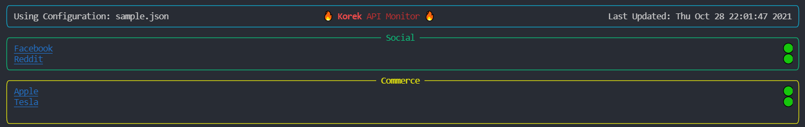

# Korek API Monitoring 



*Monitor your endpoints using **any** terminal!*

#### Usage
Execution **korek.py** and pass in the directory containing the JSON configuration files.

To use the configuration files provided in this repo, you can run from the project's root:
```
python3 korek.py -i config
```


#### JSON Configuration
The application will dynamically size the columns displayed based on the number of endpoint groups in the JSON configuration file.

At this time, all keys you see in the sample below are required.

Sample JSON:
```JSON
{
    "refresh_rate": 900,
    "endpoint_groups": [
      {
        "group_name": "Social",
        "endpoints": [
          {
            "name": "Reddit",
            "healthcheck": "https://www.reddit.com/",
            "redirect": "https://www.reddit.com/"
          },
          {
            "name": "Facebook",
            "healthcheck": "https://www.facebook.com",
            "redirect": "https://www.facebook.com"
          }
        ]
      },
      {
        "group_name": "Commerce",
        "endpoints": [
          {
            "name": "Apple",
            "healthcheck": "https://www.apple.com",
            "redirect": "https://www.apple.com"
          },
          {
            "name": "Tesla",
            "healthcheck": "https://www.tesla.com",
            "redirect": "https://www.tesla.com"
          }
        ]
      }
    ]
  }
```

Key| Description
------------ | ------------
refresh_rate | In seconds, the time between status checks.
name | What will be displayed in the terminal for the endpoint
healthcheck | URL of the healthcheck which the application will ping for 200 OK.
redirect | The URL that will open by clicking the endpoint in the terminal. Set to "" for no redirect.

